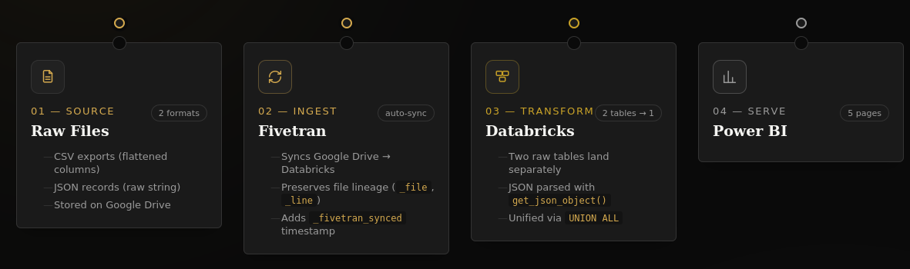
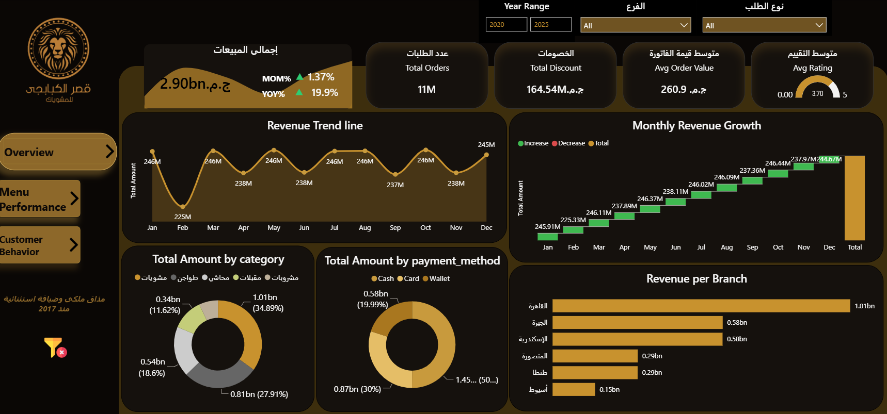
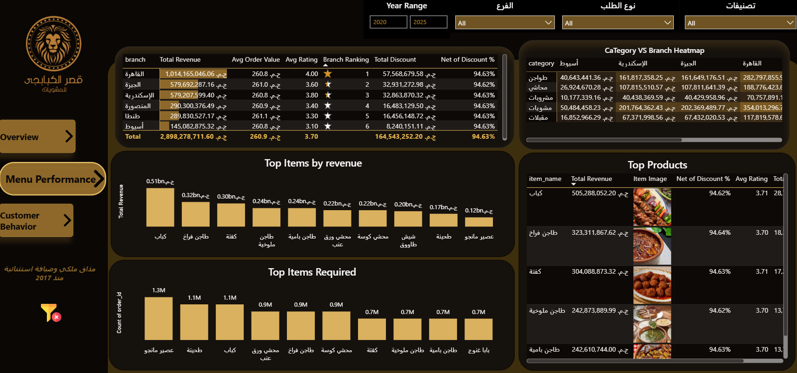
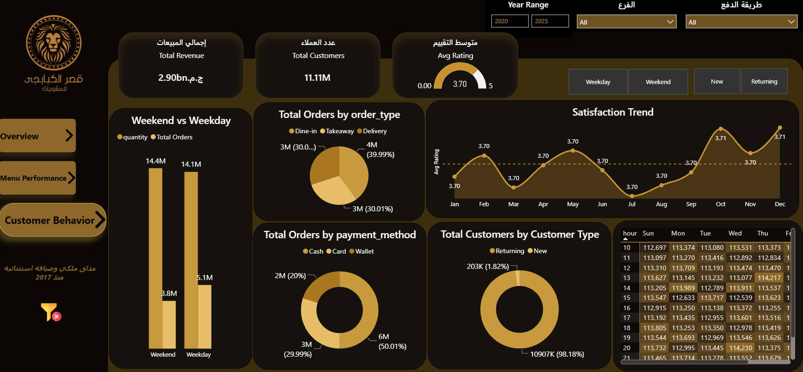

# Restaurant-Sales-Analytics-Pipeline-Databricks-Power-BI-
# 🦁 El Kababgi Palace — Restaurant Analytics Pipeline
 
End-to-end analytics pipeline for a multi-branch restaurant business: raw order files → automated ingestion → a unified data warehouse table → a Power BI reporting layer.
 
**Stack:** Fivetran · Databricks (Spark SQL) · Power BI
 
---
 
## Table of Contents
- [Overview](#overview)
- [Architecture](#architecture)
- [Data Sources](#data-sources)
- [Fivetran — Ingestion Layer](#fivetran--ingestion-layer)
- [Databricks — Transformation Layer](#databricks--transformation-layer)
- [Views](#views)
- [Data Quality Notes](#data-quality-notes)
- [Power BI — Reporting Layer](#power-bi--reporting-layer)

## Overview
 
Order-level data for a multi-branch restaurant (Cairo, Giza, Alexandria, Mansoura, Tanta, Assiut) arrives as two structurally different file types — flattened CSVs and raw JSON records. This project builds the pipeline that reconciles both into a single, query-ready table, then serves that table through a 3-page Power BI dashboard covering executive KPIs, menu performance, and customer behavior.
 
The interesting part of this project isn't the dashboard — it's everything upstream of it: two Fivetran connectors landing genuinely different schemas for the same logical entity, and the Databricks SQL layer that reconciles them.
 
## Architecture
 

 
Data flows in one direction: raw files → Fivetran → Databricks → Power BI. Each stage is described in detail below.
 
## Data Sources
 
Two file formats, same underlying order data, stored on Google Drive:
- **CSV exports** (e.g. `Copy of restaurant6.csv`) — already flattened into columns
- **JSON records** — one full order as a raw JSON string per row
## Fivetran — Ingestion Layer
 
Fivetran syncs the  folder into Databricks on an automated schedule. It doesn't just copy files — it also attaches lineage metadata to every row, which turned out to be essential for debugging later:

 ## Fivetran — Ingestion Layer
 
Fivetran syncs the Google Drive folder into Databricks on an automated schedule. It doesn't just copy files — it also attaches lineage metadata to every row, which turned out to be essential for debugging later:
 
| Column | Purpose |
|---|---|
| `_file` | Source file each row came from |
| `_line` | Row's line number within that file |
| `_modified` | Source file's last-modified timestamp |
| `_fivetran_synced` | When Fivetran synced this row |
 
Because the two source formats are structurally different, Fivetran lands them as **two separate raw tables**, not one:
 
- **`google_drive.resaurant`** — the CSV source. Fivetran already flattened it, so columns like `order_id`, `category`, `price`, etc. arrive parsed and typed.
- **`google_drive.restaurant_jason`** — the JSON source. The entire order record lands as raw text in a single `_data` column; nothing is parsed yet.
> Note: the table names (`resaurant`, `restaurant_jason`) are typos from the original connector setup, kept as-is here since renaming them would break the existing Fivetran sync.
 
## Databricks — Transformation Layer
 
This is where the two raw tables become one usable table.
 
**The problem:** `resaurant` has 18 real columns. `restaurant_jason` has 5 columns, one of which (`_data`) is an entire order encoded as a JSON string. You can't `UNION` them directly — the column lists don't match, and even if they did, one side's "data" is unreadable text.
 
**The fix:** parse `restaurant_jason`'s JSON with `get_json_object()`, cast each field to match `resaurant`'s real types, then `UNION ALL` the two shaped queries together:
 

# Data Quality Notes
 
Real issues found while building this pipeline, kept here since they're the kind of thing that costs hours if undocumented:
 
- **Two sources, two shapes.** `resaurant` and `restaurant_jason` looked interchangeable from their names alone but had completely different schemas — one pre-flattened, one raw JSON in a single column. Confirmed with `DESCRIBE` on both before writing any transformation logic, rather than assuming.

## Power BI — Reporting Layer

------

------

------

------
